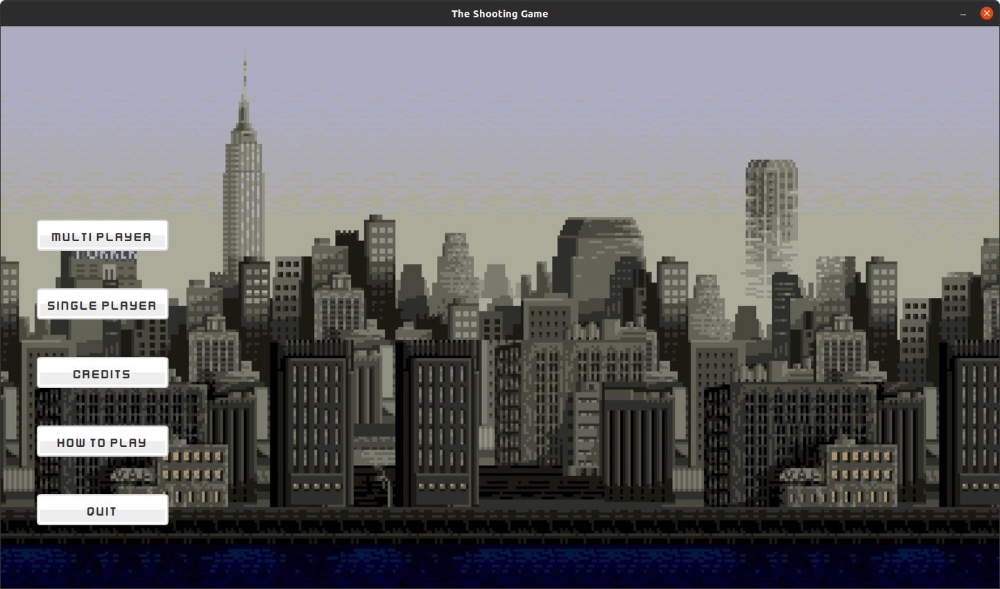
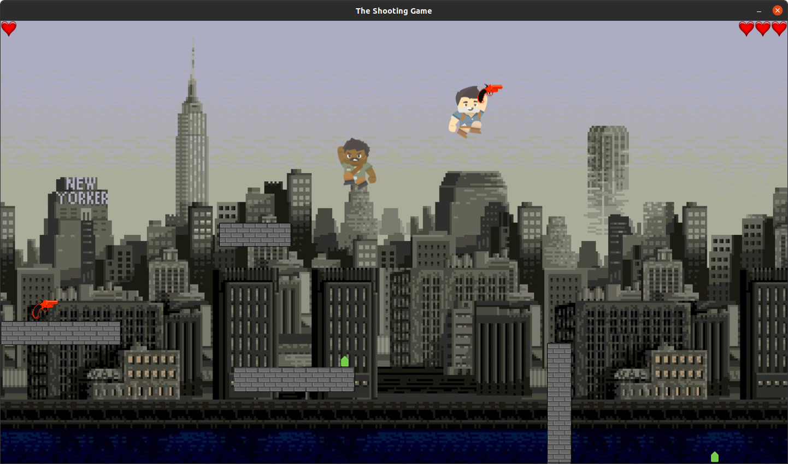
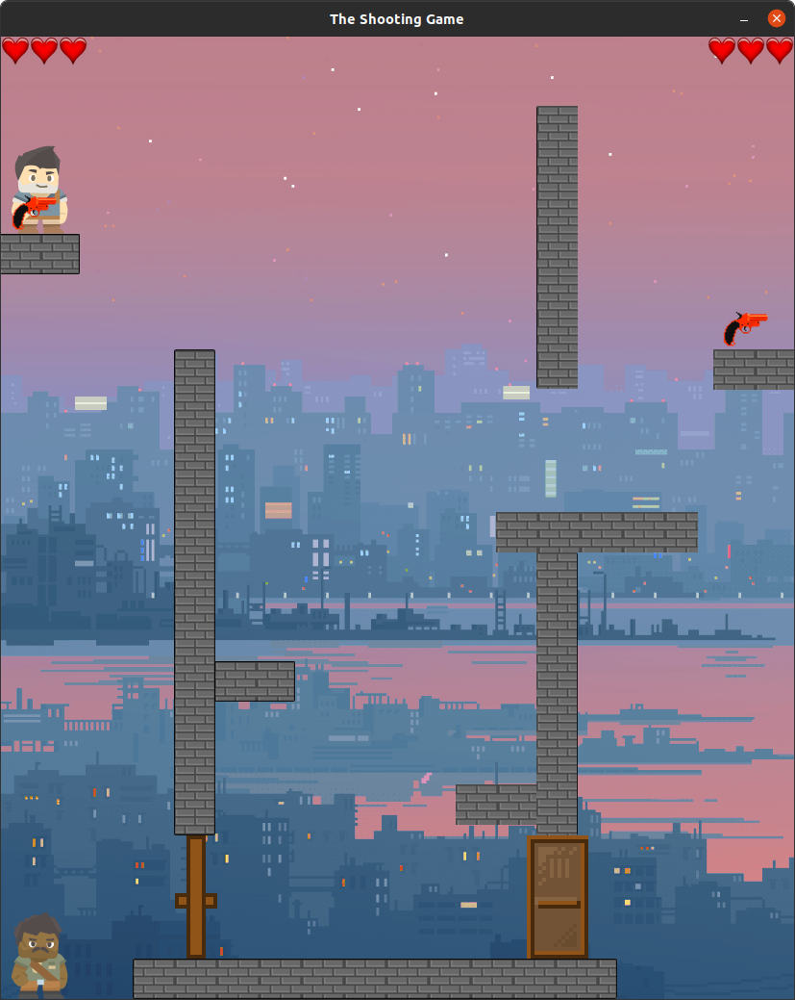

# The Shooting Game Project

---

## Project overview.

The Shooting Game project is a game, which has been made to look like The Duck Game, which is a popular platformer
shooting game.  
Game can be played alone (wow much fun) or with a friend.  
Project is build with the usage of the gradle software, so in order to compile/run it, one should have gradle software
installed.

---

## How to run the application.

Running the application is really easy.  
After installing gradle software and downloading the repository, type in the terminal following command:  
`./gradlew run`  
After performing those actions game should launch without any problems.

---

## How to play.

Main menu of the game contains the key bindings associated with player movement and board objects interactions. All one
has to do is simply press "HOW TO PLAY" button. Nevertheless, below is the keys **cheat-sheet**:  

|Move      |Player 1   |Player 2   |
|----------|-----------|-----------|
|Left      | A         | ←         |
|Right     | D         | →         |
|Up        | W         | ↑         |
|Grab Gun  | V         | 1         |
|Shoot     | B         | 3         |
|Open Door | N         | 5         |

**Hidden feature**  
In order to turn on/off explosions press key *P*.

---

## Game Feel.

Below there is a presentation of the Game:  

**Main Menu**

**First Board**

**Third Board**

